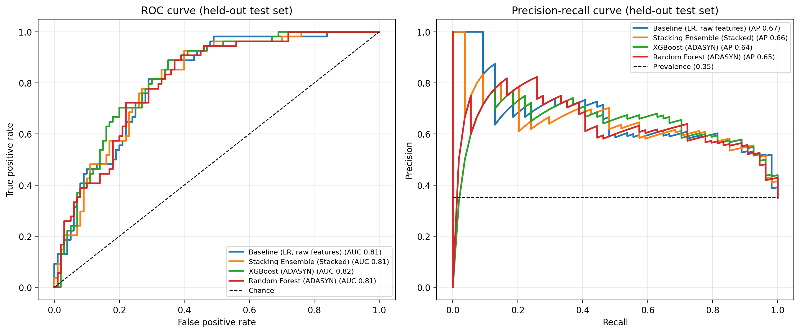
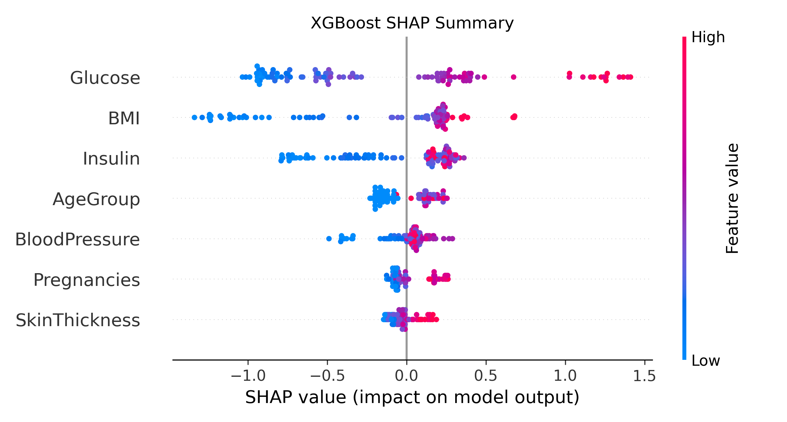

## Results

Evaluated once on a held-out, stratified test set (n = 154, of whom 54 have diabetes), random seed 42. Training used 614 patients. Metrics: [`results/test_set_metrics.csv`](results/test_set_metrics.csv), confusion matrices: [`results/test_set_confusion_matrices.csv`](results/test_set_confusion_matrices.csv), package versions: [`results/run_info.json`](results/run_info.json).

| Model | Recall | Precision | F1 | ROC AUC | PR AUC |
|---|---|---|---|---|---|
| Baseline: logistic regression, raw features | 0.704 | 0.603 | 0.650 | 0.813 | 0.673 |
| XGBoost (ADASYN) | 0.722 | 0.591 | 0.650 | 0.821 | 0.644 |
| **Stacking ensemble (final)** | **0.759** | 0.612 | 0.678 | 0.809 | 0.655 |

The baseline uses the same train/test split but none of the pipeline's steps (no KNN imputation, outlier capping, feature engineering, feature selection or ADASYN), only median imputation of the invalid zeros and scaling.

### Findings

- The stacking ensemble had the highest recall: it identified 41 of the 54 patients with diabetes, compared with 38 for the baseline, and had the fewest false negatives (13 vs 16).
- Discrimination was similar across models (ROC AUC about 0.81 for baseline, stacking and XGBoost). The baseline's PR AUC was slightly higher than the ensemble's.
- With only 154 test patients, these differences are within sampling uncertainty. For recall, the stacking-minus-baseline difference was +5.6 points with a 95% bootstrap interval of -5.0 to +17.2 points ([`results/bootstrap_ci.csv`](results/bootstrap_ci.csv)). The data support "the ensemble is competitive and catches slightly more cases", not "the ensemble is clearly better".
- SHAP shows that glucose, BMI and insulin drive the XGBoost predictions, which is consistent with clinical expectations.

## Limitations

- Small dataset (768 patients) from one population (Pima women aged 21 and over), so results may not generalise to other groups.
- The test set is small (154 patients), so the metrics have wide confidence intervals.
- Zeros in glucose, blood pressure, skin thickness, insulin and BMI were treated as missing values and imputed; this is an assumption about how the data were recorded.
- Research project only, not a validated clinical tool.

## Reproducibility

Run `python diabetes_pipeline.py`, then `python bootstrap_ci.py`. All random seeds are fixed (42), and two independent runs produced identical metrics. Exact results can differ slightly with different package versions; see `results/run_info.json`.
